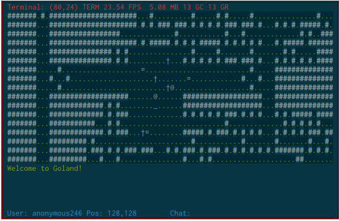

goland
======

a rogue-like terminal game in go

## Installation:

```
go get -u github.com/mischief/goland/client
go get -u github.com/mischief/goland/server
```

## Running:
Start the server:
```
cd $GOPATH/src/github.com/mischief/goland/server
./server
```

Start the client:
```
cd $GOPATH/src/github.com/mischief/goland/server
./client
```

## Debugging:
Tail the logfiles.

## Keybindings

Key | Action
--- | ------
`w a s d` | Move up, left, down, right respectively
`h j k l` | Move left, down, up, right respectively
`,`       | Pickup items at your location
`i`       | List inventory
`x`       | Drop all inventory
`ESC`     | Quit game, or exit chat mode
`<enter>` | Enter chat mode. `ESC` to exit, `<enter>` again to send, `C-u` to clear

## Other notes

Currently, walking into another player will take all of their items.

## Public Access System
not much to see here, but you can try before you buy (or download)

    ssh goland@iota.offblast.org

the password is `goland`

## Screenshots

maybe this should be called a 'textshot'

```
 Terminal: (80,24) TERM 23.65 FPS  4.54 MB 8 GC 13 GR
 #######...#####################.#.#.###.###.#.#.#.#.###.###.#...#.#.#.#####.#.
 #######...#################.............#...........#...#.............#.#..###
 #######...#####################.#.#####.#.#.#.#####.#.#.#.#.#...#.#####.######
 #######...###############.#.#...............#.....#.......#.......#.#.....####
 #######...###############.#.#.............#.#.#.#.#.###.###.#...#.#.#.#.#.####
 #######.....#...................¤.........................#.....##############
 #######...#...#...................†..†.....¤............#...#...##############
 #######.....#.............................................#.....##############
 #######...###################...¤......@..###################...##############
 #######...#############.#.#........_......###################...##############
 #######...#############.#.###......@......#.#.#.#.#.###.#.#.#...#.#.#####.####
 #######...###########...#.#.........................#.............#.#.#.#.#...
 #######...#############.#.###...†¤........#####.#.###.#.#.#.#...#.#.#.#.###.##
 #######...#########.#.......................#...........#.......#.......#...#.
 #######...#########.###.#.#.###.###...#.#.###.#.###.#.#.#.#.#.#.#######.#.#.#.
 #######...#########...#...#...............#...#.#....................##.......
 #######...###########.#.#.#.#.#####...#.###.#.###.#.###.#............######.##
 ctf: anonymous295 has 1 points!
 Ouch! You bump into anonymous257.
 You see a flag here.             
 You pick up a flag.              
 [chat] anonymous295: owned noob! 
 User: anonymous295 Pos: 128,129        Chat: woot       
```

real screenshot



